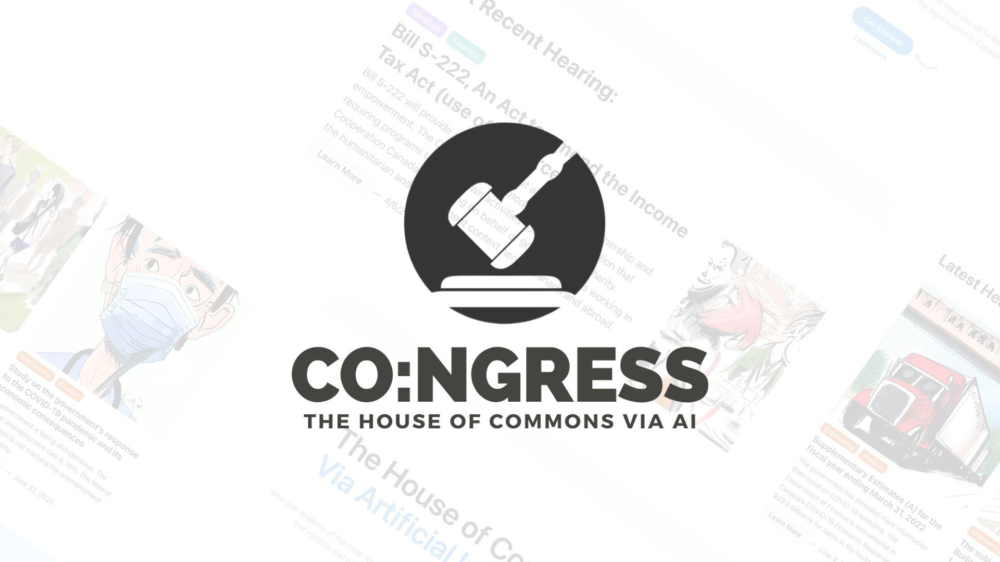
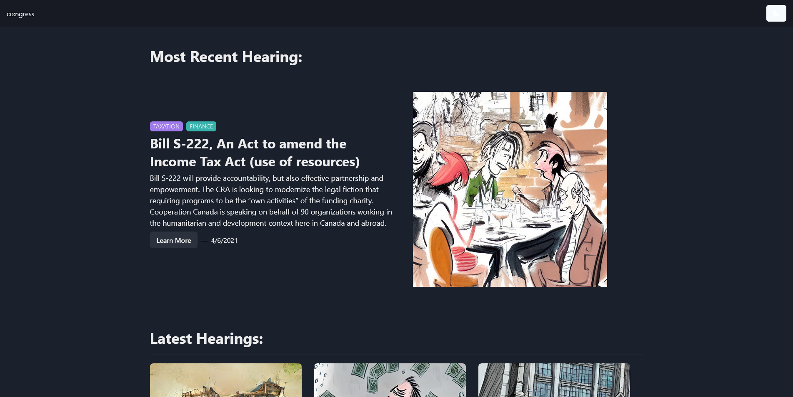

<h6 align="center">
  

  
</h6>

<a href="https://congress-ai.vercel.app/"> live site </a>

---

## Hack The Valley 7 🏆

We are proud to say that CO:NGRESS is <b>University of Toronto's</b> 2022 Hack the Valley 7 First Prize Winner! [DevPost](https://devpost.com/software/co-ngress)

## Inspiration 

We were inspired by the fact that a TL:DR is included at the start/end of most news articles, but there was no TL:DR for parliament hearings. News outlets are a great way of keeping track of what's going on in Canada, but news mostly consists of mainstream headlines and is not at all inclusive of all decisions that are being made in our country. We saw the opportunity, and went for it! A TL:DR for parliament hearings!

## What it does? 

Our app scrapes proceedings from the House of Commons of Canada and runs it through the Article Summarization feature using Open-AI

Once summarized, it roughly interprets the topic of the hearing and passes it as a prompt to Dalle3, fetching an AI-generated image, as a small entertainment factor for the user.
Storage is done with headless CMS Sanity

## Built with 🛠

- [React + TypeScript](https://reactjs.org/) (Client Application)
- [Nextjs + Vercel]
- [Sanity Headless CMS]

## Contributors ✨

- Pedram Meskoub [Linkedin](https://www.linkedin.com/in/pedramhaqiqi/)
- Efkan Serhat Goktepe [Linkedin](https://www.linkedin.com/in/serhatgoktepe/)
- Nikhil lakhwani [Linkedin](https://www.linkedin.com/in/nlakhwani/)
- Daniyal Iqbal [Linkedin](https://www.linkedin.com/in/daniyal-iqbal-726a69219/)
- Shahin Jowkar Dris [Linkedin](https://www.linkedin.com/in/shahinjowkar)

## Project Screenshot 📸

